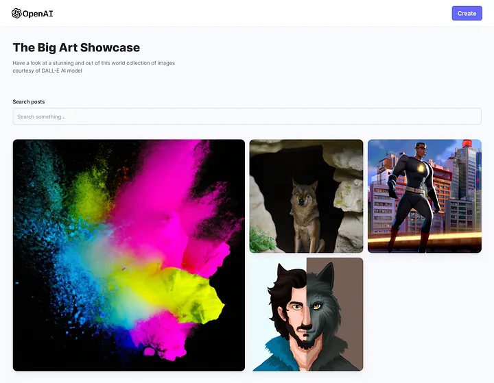

# AI Image Generation App

## Introduction

The AI Image Generation app was built by [Clinton](https://www.linkedin.com/in/clinton-mokaya/) to fulfill the requirements of the ALX foundations part of the Software Engineering Program.This is an application that lets people explore their creative sides by using prompts to generate images that they may have pictured in their minds. The app can also be used by artists to improve their work or give them a starting point for their work. You can find this blog post touching on how I went about building the project on [Medium](https://medium.com/@mokayaclinton34/how-i-built-an-ai-image-generation-web-app-5fbccc265fd7). Also, explore the deployed [AI Image Generation App](https://mo-dalle.netlify.app/) to generate some images.

## Installation

To be able to run the app locally, first, you need to clone this repository. Ensure you have Node and npm installed on your system and run the following:
- **Frontend**

  Navigate to the client folder
  ```bash
  cd client
  ```

  Now run
  ```bash
  npm install
  npm run dev
  ```
- **Backend**
  
  Navigate to the server folder
  ```bash
  cd server
  ```

  Now run
  ```bash
  npm install cloudinary cors dotenv express mongoose nodemon openai
  npm start
  ```

## Usage

Once both the backend and frontend are running(ensure you have them running on split terminals), click on the link shown on the client-side and start exploring the app. Below is a screenshot of the home page.



## Contributing

[Clinton Mokaya](https://github.com/Sn0wF1re) - The entirety of the project was handled by me and my role was working on both the backend and frontend bits of the whole project as well as integration of the backend and frontend. Debugging and all kinds of problem solving during the building process also fell within my purview.

## Related Projects

One related project is [DALL-E](https://openai.com/research/dall-e) as well as other AI image generation models such as [Stable Diffusion](https://www.google.com/url?sa=i&rct=j&q=&esrc=s&source=web&cd=&cad=rja&uact=8&ved=0CAMQw7AJahcKEwiot5Wf65L-AhUAAAAAHQAAAAAQAg&url=https%3A%2F%2Fstablediffusionweb.com%2F&psig=AOvVaw3oburz4ctPJpwdVsQVUwa1&ust=1680787458757251) and [MidJourney](https://www.midjourney.com/home/?callbackUrl=%2Fapp%2F).

## Licensing

This project is licensed under the [MIT LICENSE](./LICENSE)